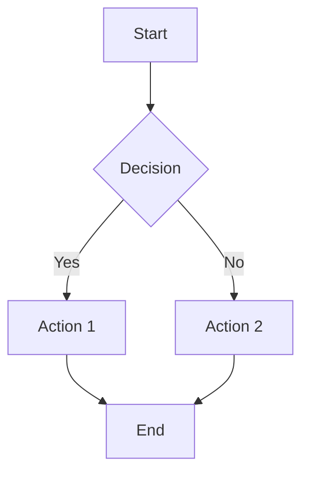

# MarkFlow 技术设计文档 v1.0

> 版本：1.0.0 状态：草稿 更新日期：2026-05-11 技术栈：Rust + Tauri v2 + TypeScript

---

## 1. 架构概览

### 1.1 整体架构

```
┌─────────────────────────────────────────────────────────────┐
│                    MarkFlow 客户端                           │
│                                                             │
│  ┌─────────────────┐           ┌─────────────────────────┐ │
│  │   Tauri 前端     │◄─────────►│      Tauri 后端 (Rust)  │ │
│  │  (WebView)       │  IPC      │                        │ │
│  │                 │           │  ┌─────────────────┐   │ │
│  │  ┌───────────┐  │           │  │  命令处理器       │   │ │
│  │  │  UI 组件   │  │           │  │  - file_*       │   │ │
│  │  │  (Solid)   │  │           │  │  - settings_*   │   │ │
│  │  └──────┬─────┘  │           │  │  - markdown_*   │   │ │
│  │         │        │           │  └────────┬────────┘   │ │
│  │  ┌──────▼──────┐ │           │           │             │ │
│  │  │ Tiptap 编辑器 │ │           │  ┌────────▼────────┐   │ │
│  │  │ (ProseMirror)│ │           │  │   核心模块       │   │ │
│  │  │              │ │           │  │  ┌───────────┐ │   │ │
│  │  │  + GFM 扩展  │ │           │  │  │ 文件系统   │ │   │ │
│  │  │  + hljs     │ │           │  │  │ 模块       │ │   │ │
│  │  │  + mermaid  │ │           │  │  └───────────┘ │   │ │
│  │  └─────────────┘ │           │  │  ┌───────────┐ │   │ │
│  │                   │           │  │  │ Markdown  │ │   │ │
│  └───────────────────┘           │  │  │ 解析器    │ │   │ │
│                                  │  │  └───────────┘ │   │ │
│                                  │  │  ┌───────────┐ │   │ │
│                                  │  │  │ 文件监听  │ │   │ │
│                                  │  │  │ 模块       │ │   │ │
│                                  │  │  └───────────┘ │   │ │
│                                  │  │  ┌───────────┐ │   │ │
│                                  │  │  │ 配置管理  │ │   │ │
│                                  │  │  │ 模块       │ │   │ │
│                                  │  │  └───────────┘ │   │ │
│                                  │  └─────────────────┘   │ │
│                                  └─────────────────────────┘ │
└─────────────────────────────────────────────────────────────┘
```

### 1.2 技术选型

| 层级 | 技术 | 说明 |
| --- | --- | --- |
| 桌面框架 | Tauri v2 | 跨平台桌面应用框架，使用系统 WebView |
| 前端框架 | Tiptap (ProseMirror) | 节点化 WYSIWYG 编辑器，成熟稳定 |
| 构建工具 | Vite | 快速开发构建 |
| Markdown 编辑 | Tiptap + ProseMirror | 所见即所得，节点化文档模型 |
| 代码高亮 | highlight.js | 代码块语法高亮 |
| 图表渲染 | Mermaid | Mermaid 图表渲染 |
| Markdown 解析 | pulldown-cmark | Rust 端 GFM 解析 |
| 文件监听 | notify | Rust 文件系统监听 |
| 配置文件 | serde_json | Rust JSON 序列化 |
| 国际化 | i18next | 前端国际化（预留） |

### 1.3 项目结构

```
markflow/
├── src/                          # 前端源代码
│   ├── main.ts                   # 前端入口
│   ├── styles/
│   │   ├── main.css              # 主样式
│   │   ├── themes/
│   │   │   ├── light.css        # 浅色主题
│   │   │   ├── dark.css         # 深色主题
│   │   │   └── sepia.css        # 护眼主题
│   │   └── variables.css         # CSS 变量定义
│   ├── components/
│   │   ├── toolbar.ts           # 工具栏组件
│   │   ├── sidebar.ts           # 侧边栏组件
│   │   ├── editor.ts            # 编辑器组件
│   │   ├── statusbar.ts         # 状态栏组件
│   │   ├── settings.ts          # 设置面板组件
│   │   ├── fileTree.ts         # 文件树组件
│   │   ├── outline.ts          # 大纲组件
│   │   ├── contextMenu.ts       # 右键菜单组件
│   │   └── toast.ts             # Toast 提示组件
│   ├── lib/
│   │   ├── editor.ts            # Tiptap 编辑器配置
│   │   ├── mermaid.ts           # Mermaid 配置
│   │   ├── theme.ts             # 主题管理
│   │   ├── pathUtils.ts         # 路径工具（getFileName, getParentDir）
│   │   ├── i18n.ts              # 国际化（预留）
│   │   └── storage.ts           # 文件系统操作封装（Tauri IPC）
│   └── utils/
│       ├── dom.ts               # DOM 工具函数
│       └── keyboard.ts          # 快捷键处理
├── src-tauri/                    # Rust 后端源代码
│   ├── src/
│   │   ├── main.rs              # Tauri 入口
│   │   ├── lib.rs               # 库入口
│   │   ├── commands/            # Tauri 命令
│   │   │   ├── mod.rs
│   │   │   ├── files.rs         # 文件操作命令
│   │   │   ├── settings.rs       # 设置命令
│   │   │   └── markdown.rs       # Markdown 命令
│   │   ├── fs/                  # 文件系统模块
│   │   │   ├── mod.rs
│   │   │   ├── watcher.rs       # 文件监听
│   │   │   └── tree.rs          # 文件树构建
│   │   ├── config/              # 配置管理
│   │   │   ├── mod.rs
│   │   │   └── settings.rs       # 设置结构体
│   │   └── markdown/             # Markdown 解析
│   │       ├── mod.rs
│   │       └── gfm.rs            # GFM 解析
│   ├── Cargo.toml
│   ├── tauri.conf.json
│   └── capabilities/             # Tauri v2 权限配置
├── docs/
│   ├── ui-design/               # 设计稿
│   │   ├── SPEC.md
│   │   └── index.html
│   ├── product-spec.md          # 产品规格文档
│   └── technical-design.md       # 本文档
├── package.json
├── tsconfig.json
├── vite.config.ts
└── README.md
```

---

## 2. 前端架构

### 2.1 UI 组件架构

采用组件化 Vanilla TypeScript，每个 UI 区域为一个独立模块：

```
App
├── Toolbar
│   ├── Brand (品牌标识)
│   ├── FileActions (文件操作按钮组)
│   ├── FormatActions (格式化按钮组)
│   ├── InsertActions (插入按钮组)
│   ├── ModeActions (模式切换按钮组)
│   └── ThemeToggle (主题切换)
├── Sidebar
│   ├── Tabs (文件/大纲 标签切换)
│   ├── FileTree (文件树)
│   │   ├── TreeFolder (文件夹节点，含 data-path)
│   │   ├── TreeFile (文件节点，含 data-path)
│   │   ├── InlineRename (内联重命名)
│   │   ├── InlineCreate (内联新建)
│   │   └── MouseDrag (拖拽移动)
│   ├── OutlineTree (大纲树)
│   └── FooterActions (底部操作)
├── EditorArea
│   ├── WYSIWYGEditor (所见即所得编辑器)
│   └── SourceEditor (源码编辑器)
├── StatusBar
│   ├── Stats (字数/行数/光标)
│   └── Actions (设置/专注/主题按钮)
├── SettingsModal
│   ├── GeneralPanel
│   ├── AppearancePanel
│   ├── EditorPanel
│   └── ShortcutsPanel
├── ContextMenu
│   ├── RenameAction
│   ├── DuplicateAction
│   └── DeleteAction
└── Toast
```

### 2.2 状态管理

使用简单的全局状态对象 + 事件驱动更新：

```typescript
// 状态定义
interface AppState {
  theme: 'light' | 'dark' | 'sepia';
  sidebar: { collapsed: boolean; tab: 'files' | 'outline' };
  editor: { mode: 'wysiwyg' | 'source'; content: string; fileId: string | null };
  workspace: { path: string | null; tree: FileNode[] };
  settings: Settings;
  ui: { contextMenu: ContextMenuState | null; settingsOpen: boolean };
}

// 状态更新
function updateState(patch: Partial<AppState>) {
  Object.assign(state, patch);
  emit('statechange', state);
}

// 订阅状态变化
function subscribe(fn: (state: AppState) => void) {
  on('statechange', fn);
}
```

### 2.3 编辑器架构

**Tiptap/ProseMirror 核心原理：**

文档结构 ≠ HTML 渲染。Markdown 语法单元映射为"节点"（Node），编辑操作直接修改节点树：

```
┌─────────────────────────────────────────────────────┐
│                   ProseMirror 文档树                  │
│  Doc                                                 │
│  ├── Heading { level: 1 } ["Welcome"]               │
│  ├── Paragraph []                                   │
│  │   └── Text ["Hello "]                           │
│  │       └── Mark { strong: true } ["World"]        │
│  ├── BulletList                                    │
│  │   └── ListItem                                  │
│  │       └── Paragraph ["Item 1"]                   │
│  ├── Table                                         │
│  │   ├── TableRow                                  │
│  │   │   └── TableCell ["Header"]                  │
│  └── CodeBlock { language: "javascript" }        │
│      └── Text ["function hello()..."]               │
└─────────────────────────────────────────────────────┘
```

**Tiptap 核心流程：**

```
用户输入 → ProseMirror 事务 → 节点更新 → 渲染更新
                                       ↕
                              Markdown 序列化（双向同步）
```

**Tiptap 配置：**

```typescript
import { Editor } from '@tiptap/core';
import StarterKit from '@tiptap/starter-kit';
import TaskList from '@tiptap/extension-task-list';
import TaskItem from '@tiptap/extension-task-item';
import Table from '@tiptap/extension-table';
import TableRow from '@tiptap/extension-table-row';
import TableCell from '@tiptap/extension-table-cell';
import TableHeader from '@tiptap/extension-table-header';
import CodeBlockLowlight from '@tiptap/extension-code-block-lowlight';
import { common, createLowlight } from 'lowlight';

const lowlight = createLowlight(common);

const editor = new Editor({
  extensions: [
    StarterKit.configure({
      codeBlock: false, // 使用 CodeBlockLowlight
    }),
    TaskList,
    TaskItem.configure({ nested: true }),
    Table.configure({ resizable: true }),
    TableRow,
    TableCell,
    TableHeader,
    CodeBlockLowlight.configure({ lowlight }),
  ],
  content: '',
  editorProps: {
    attributes: {
      class: 'prose-editor',
    },
  },
});
```

**Markdown 双向同步：**

```typescript
// 使用社区包 tiptap-markdown（Tiptap v2: ^0.8，v3: latest）
import { Markdown } from 'tiptap-markdown';

const editor = new Editor({
  extensions: [
    StarterKit,
    Markdown.configure({
      html: false,           // 纯 Markdown I/O
      tightLists: true,      // li 内不包 <p>
      bulletListMarker: '-',
      transformPastedText: true,  // 粘贴时自动解析 Markdown
      transformCopiedText: true,  // 复制时输出 Markdown
    }),
  ],
});

// 加载文件：setContent 自动将 Markdown 转为 ProseMirror 节点
editor.commands.setContent(markdownContent);

// 保存文件：getMarkdown() 将 ProseMirror 节点序列化为 Markdown
const markdown = editor.storage.markdown.getMarkdown();
await invoke('write_file', { path, content: markdown });
```

> **注意：** Tiptap v3.7.0+ 提供了官方 `@tiptap/extension-markdown`。如升级 Tiptap v3 应优先评估官方扩展。社区包 `tiptap-markdown` 与 Tiptap v2 兼容性最佳。

### 2.4 Mermaid 集成

**渲染流程：**

```
代码块识别 → 检测语言为 'mermaid'
  → 提取代码内容 → Mermaid.render()
  → 替换代码块为 SVG
```

**实现：**

```typescript
// 编辑器渲染后扫描所有 mermaid 代码块
function renderMermaidBlocks() {
  const blocks = document.querySelectorAll('pre code.language-mermaid');
  blocks.forEach(async (block) => {
    const code = block.textContent;
    const container = block.parentElement!;

    if (container.querySelector('.mermaid')) return;

    try {
      const { svg } = await mermaid.render(`mermaid-${Date.now()}`, code);
      const wrapper = document.createElement('div');
      wrapper.className = 'mermaid';
      wrapper.innerHTML = svg;
      container.replaceWith(wrapper);
    } catch (err) {
      console.error('Mermaid render error:', err);
    }
  });
}
```

### 2.5 GFM 测试样例

以下测试样例用于验证 Tiptap 对 GFM 的完整支持：

#### 2.5.1 基础语法

```markdown
# H1 标题
## H2 标题
### H3 标题
#### H4 标题
##### H5 标题
###### H6 标题

**粗体文字**
*斜体文字*
~~删除线文字~~
`行内代码`

> 引用块
> 多行引用
> > 嵌套引用
```

#### 2.5.2 列表

```markdown
无序列表：
- 项目一
- 项目二
  - 嵌套项目
    - 深嵌套

有序列表：
1. 第一项
2. 第二项
3. 第三项

任务列表：
- [x] 已完成任务
- [ ] 未完成任务
- [x] 另一个完成
```

#### 2.5.3 表格

```markdown
| 表头1 | 表头2 | 表头3 |
|-------|-------|-------|
| 单元格1 | 单元格2 | 单元格3 |
| 单元格4 | 单元格5 | 单元格6 |
| 左对齐 | 居中 | 右对齐 |
|:-----|:----:|-----:|
| 数据 | 数据 | 数据 |
```

#### 2.5.4 代码块

```markdown
```javascript
function hello() {
  console.log("Hello, World!");
}
```

```python
def hello():
    print("Hello, World!")
```
```

#### 2.5.5 Mermaid 图表

```markdown

```

#### 2.5.6 链接与图片

```markdown
[链接文字](https://example.com)


[](large.png)
```

### 2.6 主题系统

**CSS 变量架构：**

```css
/* variables.css */
:root {
  --bg: #FAFAF8;
  --surface: #FFFFFF;
  --fg: #1A1A1A;
  --muted: #767676;
  --border: #E5E3DF;
  --accent: #B5472A;
  --accent-soft: rgba(181,71,42,0.10);
  --code-bg: #F2F0ED;
  --selection: rgba(181,71,42,0.12);
  --shadow: 0 4px 24px rgba(0,0,0,0.08);
}

[data-theme="dark"] {
  --bg: #18181B;
  --surface: #1F1F23;
  --fg: #E8E8E8;
  --muted: #71717A;
  --border: #2E2E33;
  --accent: #E8715A;
  --accent-soft: rgba(232,113,90,0.15);
  --code-bg: #27272A;
  --selection: rgba(232,113,90,0.18);
  --shadow: 0 4px 24px rgba(0,0,0,0.3);
}

[data-theme="sepia"] {
  --bg: #F4ECD8;
  --surface: #FAF6ED;
  --fg: #5C4B37;
  --muted: #8B7355;
  --border: #E0D5C0;
  --accent: #8B5A2B;
  --accent-soft: rgba(139,90,43,0.12);
  --code-bg: #EDE5D0;
  --selection: rgba(139,90,43,0.15);
  --shadow: 0 4px 24px rgba(92,75,55,0.10);
}
```

---

## 3. Rust 后端架构

### 3.1 命令接口

Tauri 命令通过 IPC 调用，以下是核心命令：

#### 文件操作命令

```rust
#[tauri::command]
async fn read_file(path: String) -> Result<String, String>;

#[tauri::command]
async fn write_file(path: String, content: String) -> Result<(), String>;

#[tauri::command]
async fn create_file(path: String, content: Option<String>) -> Result<(), String>;

#[tauri::command]
async fn create_dir(path: String) -> Result<(), String>;

#[tauri::command]
async fn rename_path(from: String, to: String) -> Result<(), String>;

#[tauri::command]
async fn delete_path(path: String) -> Result<(), String>;

#[tauri::command]
async fn copy_file(from: String, to: String) -> Result<(), String>;

#[tauri::command]
async fn read_dir_recursive(path: String) -> Result<Vec<FileEntry>, String>;

#[tauri::command]
async fn read_single_dir(path: String) -> Result<Vec<FileEntry>, String>;

#[tauri::command]
async fn set_workspace(path: String) -> Result<(), String>;

#[tauri::command]
async fn get_workspace() -> Result<Option<String>, String>;
```

`read_single_dir` 是非递归目录读取，仅返回目录的直接子项（文件夹在前，按名称排序），用于文件树的外科手术式 DOM 更新（创建/复制后获取新条目）。

#### 文件监听命令

```rust
#[tauri::command]
async fn start_file_watcher(path: String) -> Result<(), String>;

#[tauri::command]
async fn stop_file_watcher() -> Result<(), String>;
```

**事件 payload 类型：**

```rust
#[derive(Clone, Serialize)]
pub struct FileChangeEvent {
    pub path: String,           // 变化文件的绝对路径
    pub kind: FileChangeKind,   // 变化类型
    pub timestamp: u64,         // Unix 毫秒时间戳
}

#[derive(Clone, Serialize)]
pub enum FileChangeKind {
    Create,
    Modify,
    Delete,
    Rename { from: String, to: String },
}
```

**Watcher 生命周期：**

- 归属：Watcher 实例绑定到 AppHandle，随应用生命周期管理
- 启动：前端调用 `start_file_watcher` 时创建，监听工作区根目录递归
- 停止：切换工作区或退出应用时调用 `stop_file_watcher`，自动 drop watcher
- 事件分发：通过 `app_handle.emit("file-changed", payload)` 推送到前端

#### Markdown 命令

```rust
#[tauri::command]
fn parse_markdown(content: String) -> Result<String, String>;

#[tauri::command]
fn extract_outline(content: String) -> Result<Vec<OutlineItem>, String>;
```

#### 设置命令

```rust
#[tauri::command]
fn get_settings() -> Result<Settings, String>;

#[tauri::command]
fn update_settings(settings: Settings) -> Result<(), String>;
```

### 3.2 文件监听模块

使用 `notify` crate 监听文件系统变化。Watcher 实例绑定到 AppHandle，随应用生命周期管理。

```rust
use notify::{Config, Event, RecommendedWatcher, RecursiveMode, Watcher};
use std::sync::mpsc::channel;

pub struct FileWatcher {
    watcher: RecommendedWatcher,
    #[allow(dead_code)]
    path: PathBuf,
}

impl FileWatcher {
    pub fn new<F>(path: PathBuf, on_change: F) -> Result<Self, notify::Error>
    where
        F: Fn(Event) + Send + 'static,
    {
        let (tx, rx) = channel();

        let watcher = RecommendedWatcher::new(
            move |res| {
                if let Ok(event) = res {
                    let _ = tx.send(event);
                }
            },
            Config::default(),
        )?;

        std::thread::spawn(move || {
            while let Ok(event) = rx.recv() {
                if matches!(event.kind, EventKind::Modify(_) | EventKind::Remove(_) | EventKind::Rename(_)) {
                    on_change(event);
                }
            }
        });

        Ok(Self { watcher, path })
    }

    pub fn watch(&mut self) -> Result<(), notify::Error> {
        self.watcher.watch(&self.path, RecursiveMode::Recursive)
    }
}
```

#### 3.2.1 路径标准化

Watcher 在 Windows 上发出的路径使用反斜杠（`\`）。为确保与前端路径一致，Rust 端在发送事件前将所有反斜杠替换为正斜杠：

```rust
// watcher.rs
let normalized = event.paths.first()?
    .to_string_lossy()
    .to_string()
    .replace('\\', "/");
```

#### 3.2.2 Watcher 事件抑制

当前端执行自操作（创建、删除、重命名、拖拽移动）时，会触发 OS 文件监听器产生事件。为避免这些自身操作导致整个文件树重建，前端使用 `suppressPaths` 机制：

```typescript
// fileTree.ts
const suppressPaths: Set<string> = new Set();

// 操作前：注册需要抑制的路径
suppressNextWatcherRefresh(path);
suppressAllDescendants(path); // 抑制路径本身及所有子路径

// main.ts 监听器中：检查是否应跳过
listen<FileChangeEvent>('file-changed', (event) => {
  const { path, kind } = event.payload;
  if (kind === 'create' || kind === 'delete') {
    if (!isSuppressedPath(path)) {
      refreshFileTree();
    }
  }
});
```

`isSuppressedPath` **使用前缀匹配**：对于文件夹操作，需要抑制文件夹本身及其所有子路径的事件。例如抑制 `workspace/folder` 会同时匹配 `workspace/folder/a.md`。

### 3.3 文件树架构

文件树采用**外科手术式 DOM 更新**策略，避免全量重建导致的文件夹折叠状态丢失。

#### 3.3.1 DOM 结构

```
#file-tree
├── .tree-file[data-path=".../a.md"]        # 文件节点
├── .tree-folder-wrapper                     # 文件夹包装器
│   ├── .tree-folder[data-path=".../docs"]   # 文件夹头部（图标 + 名称）
│   └── .tree-children                       # 子节点容器
│       ├── .tree-file[data-path="..."]
│       └── .tree-folder-wrapper
│           └── ...
```

- 文件夹和文件节点均有 `data-path` 属性，用于通过 CSS 选择器快速定位
- 文件夹使用 `.tree-folder-wrapper` 包装器，同时作为拖拽放置目标
- 子节点按文件夹在前、文件在后、各自按名称字母排序

#### 3.3.2 外科手术式 DOM 操作

四个核心函数避免全量重建：

| 函数 | 用途 | 实现 |
| --- | --- | --- |
| `insertEntryIntoTree(parentPath, entry)` | 创建/复制后插入节点 | 找到父容器，按排序位置插入，自动展开父文件夹 |
| `removeEntryFromTree(path)` | 删除后移除节点 | 通过 `data-path` 定位，文件直接删除，文件夹删除 wrapper |
| `renameEntryInTree(oldPath, newName)` | 重命名后更新节点 | 更新 span 文本和 `data-path`，重新排序到正确位置 |
| `refreshFileTree()` | 外部变更时全量重建 | 保留展开状态 → 递归读取 → 重建 DOM → 恢复展开状态 |

**插入排序逻辑**（`insertSorted`）：

1. 遍历父容器的子节点
2. 文件夹节点跳过（文件夹排前面）
3. 遇到第一个名称 &gt;= 新节点名称的同类型节点，在其前面插入
4. 如果没有找到合适位置，追加到末尾

#### 3.3.3 鼠标拖拽移动

由于 Tauri WebView2 不支持 HTML5 Drag API 事件，拖拽使用原生鼠标事件实现：

```
mousedown (记录源元素和路径)
    ↓ 移动超过 5px
mousemove → 创建 ghost 元素跟随鼠标
         → 检测目标文件夹（elementFromPoint）
         → 高亮目标文件夹（.dragover class）
         → 悬停 500ms 自动展开折叠文件夹
    ↓ 释放
mouseup → 计算目标目录
       → 抑制 watcher 事件
       → 调用 renamePath 执行移动
       → 更新 DOM（文件：外科手术式插入，文件夹：全量重建）
```

**关键实现细节：**

- Ghost 元素：`cloneNode(true)` 源元素，`position: fixed`，`pointer-events: none`
- 放置目标检测：`document.elementFromPoint()` + `.closest('.tree-folder-wrapper')`
- 根目录放置：检测 `target === fileTree`，将文件移至工作区根目录
- 循环移动保护：检查源路径是否是目标路径的前缀（`startsWith`）
- 自引用保护：`srcPath !== destPath && srcParent !== destDir`
- CSS `user-select: none` 防止拖拽时文本选中干扰

#### 3.3.4 内联编辑（重命名/新建）

**重命名流程**：

1. 右键菜单触发 → 隐藏 `<span>`，插入 `<input>` 元素
2. 自动选中文件名（不含扩展名）
3. Enter 确认 → 调用 `renamePath`，更新 DOM，重新排序
4. Escape 取消 → 恢复 `<span>`
5. Blur 也触发确认（提交当前值）

**新建流程**：

1. 右键菜单/侧边栏按钮触发 → 在排序位置插入临时节点（带 `<input>`）
2. Enter 确认 → 调用 `createFile`/`createDir`，通过 `readSingleDir` 获取新条目，替换临时节点为真实节点
3. Escape 取消 → 移除临时节点
4. 自动展开目标文件夹

**输入框创建**（`createInlineInput`）：

```typescript
const input = document.createElement('input');
input.type = 'text';
input.className = 'tree-inline-input';
input.spellcheck = false;
input.setAttribute('autocomplete', 'off');
input.setAttribute('autocorrect', 'off');
input.setAttribute('autocapitalize', 'off');
```

### 3.3 配置管理

配置文件存储在 `~/.config/MarkFlow/settings.json`：

```rust
use serde::{Deserialize, Serialize};

#[derive(Debug, Clone, Serialize, Deserialize)]
pub struct Settings {
    pub theme: String,
    pub follow_system: bool,
    pub font_size: u32,
    pub line_height: f32,
    pub spellcheck: bool,
    pub soft_wrap: bool,
    pub live_preview: bool,
    pub code_highlight: bool,
    pub line_numbers: bool,
    pub sidebar_visible: bool,
    pub tooltips: bool,
    pub autosave: bool,
    pub autosave_interval: u32,
}

impl Default for Settings {
    fn default() -> Self {
        Self {
            theme: "light".to_string(),
            follow_system: false,
            font_size: 18,
            line_height: 1.7,
            spellcheck: true,
            soft_wrap: true,
            live_preview: true,
            code_highlight: true,
            line_numbers: false,
            sidebar_visible: true,
            tooltips: true,
            autosave: true,
            autosave_interval: 10000,
        }
    }
}

impl Settings {
    pub fn load() -> Result<Self, String> {
        let config_dir = dirs::config_dir()
            .ok_or("Cannot find config directory")?
            .join("MarkFlow");

        let config_path = config_dir.join("settings.json");

        if config_path.exists() {
            let content = std::fs::read_to_string(&config_path)
                .map_err(|e| e.to_string())?;
            serde_json::from_str(&content)
                .map_err(|e| e.to_string())
        } else {
            Ok(Self::default())
        }
    }

    pub fn save(&self) -> Result<(), String> {
        let config_dir = dirs::config_dir()
            .ok_or("Cannot find config directory")?
            .join("MarkFlow");

        std::fs::create_dir_all(&config_dir)
            .map_err(|e| e.to_string())?;

        let config_path = config_dir.join("settings.json");
        let content = serde_json::to_string_pretty(self)
            .map_err(|e| e.to_string())?;

        std::fs::write(&config_path, content)
            .map_err(|e| e.to_string())
    }
}
```

### 3.4 Markdown 解析

使用 `pulldown-cmark` 进行 GFM 解析：

```rust
use pulldown_cmark::{html, Options, Parser};

pub fn markdown_to_html(markdown: &str) -> String {
    let mut options = Options::empty();
    options.insert(Options::ENABLE_TABLES);
    options.insert(Options::ENABLE_STRIKETHROUGH);
    options.insert(Options::ENABLE_TASKLISTS);

    let parser = Parser::new_ext(markdown, options);
    let mut html_output = String::new();
    html::push_html(&mut html_output, parser);

    html_output
}

#[derive(Debug, Clone, serde::Serialize)]
pub struct OutlineItem {
    pub level: u8,
    pub text: String,
    pub line: usize,
}

pub fn extract_outline(markdown: &str) -> Vec<OutlineItem> {
    let mut items = Vec::new();

    for (line_num, line) in markdown.lines().enumerate() {
        let level = line.chars()
            .take_while(|c| *c == '#')
            .count();

        if level > 0 && level <= 6 {
            let text = line[level..].trim().to_string();
            items.push(OutlineItem {
                level: level as u8,
                text,
                line: line_num + 1,
            });
        }
    }

    items
}
```

---

## 4. Tauri v2 配置

### 4.1 tauri.conf.json

```json
{
  "$schema": "https://schema.tauri.app/config/2",
  "productName": "MarkFlow",
  "version": "1.0.0",
  "identifier": "com.markflow.app",
  "build": {
    "beforeDevCommand": "npm run dev",
    "devUrl": "http://localhost:1420",
    "beforeBuildCommand": "npm run build",
    "frontendDist": "../dist"
  },
  "app": {
    "withGlobalTauri": true,
    "windows": [
      {
        "title": "MarkFlow",
        "width": 1200,
        "height": 800,
        "minWidth": 800,
        "minHeight": 600,
        "resizable": true,
        "fullscreen": false,
        "center": true
      }
    ],
    "security": {
      "csp": "default-src 'self'; script-src 'self' 'unsafe-inline'; style-src 'self' 'unsafe-inline' https://fonts.googleapis.com; font-src 'self' https://fonts.gstatic.com; img-src 'self' data: blob:; connect-src 'self'"
    }
  },
  "bundle": {
    "active": true,
    "targets": "all",
    "icon": [
      "icons/32x32.png",
      "icons/128x128.png",
      "icons/128x128@2x.png",
      "icons/icon.icns",
      "icons/icon.ico"
    ],
    "windows": {
      "webviewInstallMode": {
        "type": "embedBootstrapper"
      }
    }
  },
  "plugins": {
    "shell": {
      "open": true
    }
  }
}
```

### 4.2 权限配置 (capabilities)

```json
{
  "$schema": "https://schema.tauri.app/config/2",
  "identifier": "main-capability",
  "description": "MarkFlow main capabilities",
  "windows": ["main"],
  "permissions": [
    "core:default",
    "dialog:default",
    "dialog:allow-open",
    "dialog:allow-save",
    "fs:default",
    "fs:allow-read-text-file",
    "fs:allow-write-text-file",
    "fs:allow-exists",
    "fs:allow-mkdir",
    "fs:allow-remove",
    "fs:allow-rename",
    "fs:allow-copy-file",
    {
      "identifier": "fs:scope",
      "allow": [{ "path": "$APPDATA/**" }]
    }
  ]
}
```

> **动态工作区权限授予：** Tauri v2 的 `dialog:allow-open` 在用户选择文件夹时，会自动将该路径加入 fs scope（`dialog.plugin.autoGrantPermissions` 默认开启）。因此无需在 capability 文件中预置工作区路径——用户通过对话框选择文件夹后即获得该目录的读写权限。`$APPDATA/**` 仅覆盖应用配置目录（settings.json 存储位置）。
> ****记住工作区与 scope 持久化：** dialog 的 scope 变更默认不持久化，应用重启后清空。使用 `tauri-plugin-persisted-scope` 可自动将用户授权路径写入 capability 配置并跨重启保留。或者启动时由 Rust 后端读取 `settings.json` 中保存的 workspace 路径，自行做路径校验后直接读写文件。
> ****自定义 Rust 命令的路径校验：** Tauri 的 fs scope 仅约束 fs 插件命令，自定义 Rust 命令（`read_file`/`write_file` 等）不受 scope 限制。Rust 端必须对所有传入路径做以下校验：
>
> ```rust
> fn validate_path(target: &Path, workspace_root: &Path) -> Result<PathBuf, String> {
>     let target = target.canonicalize().map_err(|_| "Path does not exist")?;
>     let root = workspace_root.canonicalize().map_err(|_| "Workspace not found")?;
>     if !target.starts_with(&root) {
>         return Err("Path outside workspace".into());
>     }
>     if target.is_symlink() {
>         return Err("Symlink not allowed".into());
>     }
>     Ok(target)
> }
> ```
>
> 校验规则：`canonicalize()` 解析真实路径后判断归属；拒绝不存在的路径、符号链接逃逸、非 workspace 内路径。

---

## 5. 构建与发布

### 5.1 GitHub Actions 工作流

```yaml
# .github/workflows/build.yml
name: Build and Release

on:
  push:
    tags:
      - 'v*'
  workflow_dispatch:

jobs:
  build:
    strategy:
      fail-fast: false
      matrix:
        include:
          - platform: 'macos-latest'
            args: '--target x86_64-apple-darwin'
          - platform: 'macos-latest'
            args: '--target aarch64-apple-darwin'
          - platform: 'ubuntu-22.04'
            args: ''
          - platform: 'windows-latest'
            args: ''

    runs-on: ${{ matrix.platform }}
    steps:
      - uses: actions/checkout@v4

      - name: Setup Node
        uses: actions/setup-node@v4
        with:
          node-version: 20

      - name: Setup Rust
        uses: dtolnay/rust-toolchain@stable

      - name: Install dependencies (Ubuntu)
        if: matrix.platform == 'ubuntu-22.04'
        run: |
          sudo apt-get update
          sudo apt-get install -y libwebkit2gtk-4.1-dev \
                                 libappindicator3-dev \
                                 librsvg2-dev \
                                 patchelf

      - name: Install frontend dependencies
        run: npm ci

      - name: Build frontend
        run: npm run build

      - name: Build Tauri app
        uses: tauri-apps/tauri-action@v0
        env:
          GITHUB_TOKEN: ${{ secrets.GITHUB_TOKEN }}
        with:
          args: ${{ matrix.args }}

  release:
    needs: build
    runs-on: ubuntu-latest
    if: startsWith(github.ref, 'refs/tags/v')
    steps:
      - name: Download all artifacts
        uses: actions/download-artifact@v4

      - name: Create Release
        uses: softprops/action-gh-release@v1
        with:
          files: |
            **/*.exe
            **/*.msi
            **/*.dmg
            **/*.AppImage
            **/*.deb
          generate_release_notes: true
```

### 5.2 构建产物

| 平台 | 产物格式 | 文件名模式 |
| --- | --- | --- |
| Windows | .exe (NSIS) | MarkFlow_x.x.x_x64-setup.exe |
| Windows | .msi | MarkFlow_x.x.x_x64_en-US.msi |
| macOS | .dmg | MarkFlow_x.x.x_aarch64.dmg |
| macOS | .dmg | MarkFlow_x.x.x_x64.dmg |
| Linux | .AppImage | markflow_x.x.x_amd64.AppImage |
| Linux | .deb | markflow_x.x.x_amd64.deb |

---

## 6. 关键实现细节

### 6.1 文件树数据结构

```typescript
// storage.ts — 与 Rust 端 FileEntry 对应
interface FileEntry {
  name: string;
  path: string;       // 绝对路径（正斜杠标准化）
  isDir: boolean;
  children?: FileEntry[];  // 仅 readDirRecursive 返回时填充
}
```

**路径标准化**：Rust 端返回的路径统一使用正斜杠（`/`），前端 `setWorkspacePath` 也执行 `path.replace(/\\/g, '/')` 确保一致。

### 6.2 所见即所得编辑策略

```typescript
function handleEditorInput() {
  // 1. 保存选区
  const selection = saveSelection();

  // 2. 获取纯文本
  const text = extractPlainText(editor);

  // 3. 解析 Markdown
  const html = md.render(text);

  // 4. 增量更新 DOM
  updateEditorContent(editor, html);

  // 5. 恢复选区
  restoreSelection(selection);

  // 6. 更新状态
  updateStats();
  if (sidebarTab === 'outline') renderOutline();
}
```

### 6.3 外部文件监听与冲突策略

#### 6.3.1 编辑器状态机

```typescript
enum EditorState {
  CLEAN = 'clean',   // 文件未修改，与磁盘一致
  DIRTY = 'dirty',   // 文件有未保存的修改
}

let editorState: EditorState = EditorState.CLEAN;

// 内容变化时标记 dirty
editor.on('update', () => {
  editorState = EditorState.DIRTY;
});

// 保存后标记 clean，同时忽略此次自身保存的文件事件
editor.commands.save().then(() => {
  editorState = EditorState.CLEAN;
  ignoreNextFileEvent(currentFilePath); // 忽略 500ms 内的自身写入事件
});
```

#### 6.3.2 文件监听处理流程

```typescript
// main.ts
import { listen } from '@tauri-apps/api/event';

interface FileChangeEvent {
  path: string;
  kind: string;
  timestamp: number;
}

listen<FileChangeEvent>('file-changed', (event) => {
  const { path, kind } = event.payload;
  const activePath = getActiveFilePath();

  // 当前打开的文件被外部修改 → 提示用户
  if (activePath && path === activePath && kind === 'modify') {
    showToast('文件已被外部修改');
  }

  // 文件创建/删除事件 → 刷新文件树（除非被抑制）
  if (kind === 'create' || kind === 'delete') {
    if (!isSuppressedPath(path)) {
      refreshFileTree();
    }
  }
});
```

**Watcher 事件抑制机制**（详见 3.2.2）：前端在执行自操作（创建、删除、重命名、拖拽移动）前，将相关路径加入 `suppressPaths` 集合。监听器检查事件路径是否被抑制，如果是则跳过 `refreshFileTree()`，由外科手术式 DOM 操作处理更新。

#### 6.3.3 冲突对话框

| 选项 | 行为 |
| --- | --- |
| 保留本地 | 忽略外部变化，保持当前编辑 |
| 加载外部 | 丢弃本地修改，加载外部版本 |
| 手动合并 | 打开 diff 视图，逐段选择保留内容 |

---

## 7. 安全性考虑

### 7.1 安全基线

#### 7.1.1 CSP 配置

```json
{
  "app": {
    "security": {
      "csp": "default-src 'self'; script-src 'self' 'unsafe-inline'; style-src 'self' 'unsafe-inline' https://fonts.googleapis.com; font-src 'self' https://fonts.gstatic.com; img-src 'self' data: blob:; connect-src 'self'"
    }
  }
}
```

**说明：**

- 禁用远程脚本（`'self'` 仅允许同源）
- 禁用 `unsafe-eval`（防止动态代码执行）
- 图片仅允许 `data:` 和 `blob:`（Mermaid SVG 输出）
- 不预置 PlantUML 外部连接（v2 按需启用）

#### 7.1.2 文件访问限制

- 只能访问用户通过对话框明确授权的文件夹（dialog 选择后自动加入 fs scope）
- 不允许访问系统敏感目录
- shell:allow-open 仅用于外部链接，不用于脚本执行

#### 7.1.3 Mermaid SVG Sanitization

Mermaid 渲染的 SVG 输出需要 sanitize 处理：

- 禁止脚本标签（`<script>` → 移除）
- 禁止事件属性（`onclick`、`onload` 等 → 移除）
- 禁止外部资源加载（`xlink:href` 指向外部 → 移除）
- 使用 DOMPurify 或同等级库处理 SVG 字符串

#### 7.1.4 权限最小化原则

| 权限 | 用途 | 限制 |
| --- | --- | --- |
| fs:allow-read-text-file | 读取工作区 .md 文件 | 仅用户选择的目录 scope |
| fs:allow-write-text-file | 写入工作区 .md 文件 | 仅用户选择的目录 scope |
| dialog:allow-open | 用户选择工作区文件夹 | 需用户主动触发 |

---

## 8. 性能优化

### 8.1 前端优化

| 优化点 | 方案 |
| --- | --- |
| Markdown 渲染 | 使用 `requestAnimationFrame` 节流 |
| 文件树渲染 | 大文件夹使用虚拟列表 |
| 图片加载 | 使用 `loading="lazy"` |
| 首屏加载 | Vite 代码分割 |

### 8.2 Rust 后端优化

| 优化点 | 方案 |
| --- | --- |
| 文件监听 | 使用 `notify` 的 debounce |
| 序列化 | 使用 `serde_json` 缓存 |

---

## 9. 测试策略

### 9.1 测试类型

| 类型 | 范围 |
| --- | --- |
| 单元测试 | Rust 命令、Markdown 解析、前端工具函数 |
| 集成测试 | Tauri 命令、文件系统操作 |
| E2E 测试 | Playwright 覆盖关键用户流程 |
| 手动测试 | 按产品规格验收清单 |

---

## 10. 未来扩展预留

### 10.1 插件系统

预留插件扩展点：

- Markdown 解析器可扩展
- 渲染器可扩展（支持新的代码块语言）
- 主题系统已预留扩展接口

### 10.2 国际化

前端使用 `i18next`，架构已预留多语言支持。

### 10.3 云同步（未来）

架构设计允许未来添加云同步功能，文件操作抽象为接口。