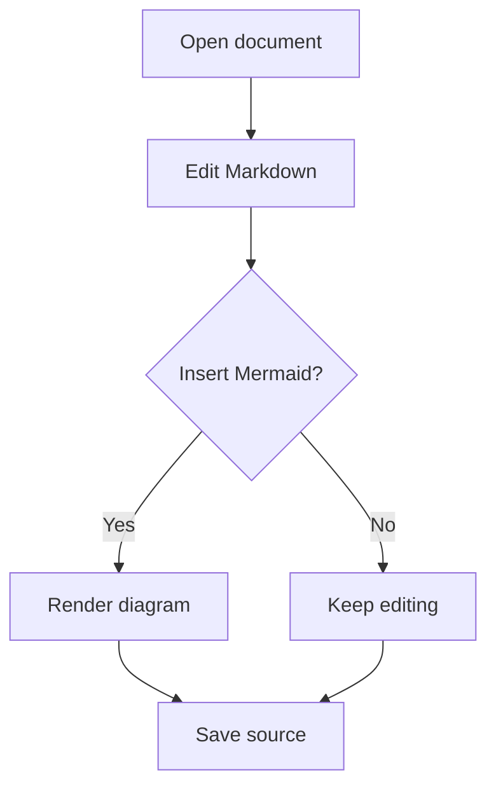
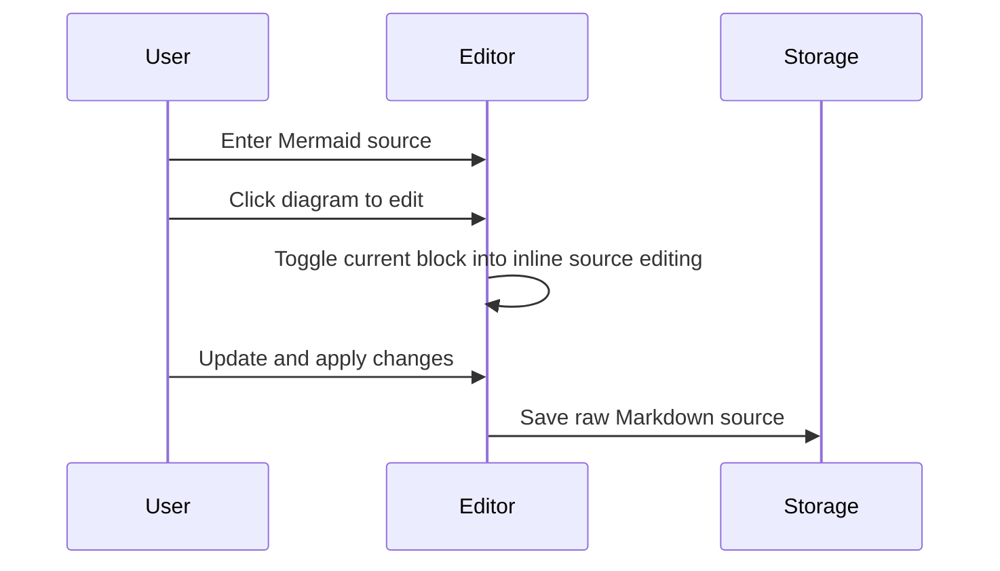
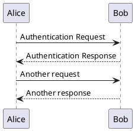
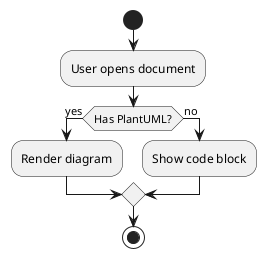

# MarkFlow English Example

This is a sample Markdown document for testing **MarkFlow**.


## Basic Formatting

- Unordered list item
- Supports **bold**, *italic*, and ~~strikethrough~~
- Supports `inline code`

1. First ordered item
2. Second ordered item
3. Third ordered item

> This is a blockquote.
>
> It can be used to verify block-level quote styling.

---

## Task List

- [x] Core Markdown editor implemented

- [x] Image support added

- [x] Mermaid rendering enabled

- [ ] Add more example documents

## Table

| Feature | Status | Notes |
| --- | --- | --- |
| WYSIWYG editing | Done | Main editing experience |
| Source mode | Done | Direct Markdown editing |
| Mermaid diagrams | Done | Render in preview, save raw source |

### Table Example

| Module | Priority | Owner | Notes |
| --- | --- | --- | --- |
| Editor | High | Ryan | Main development area |
| File Tree | Medium | MarkFlow | Supports drag and rename |
| Mermaid | High | Claude | Preview rendering and source editing |
| Example Docs | Low | Docs | Used to demonstrate features |

## Code Block

```ts
function greet(name: string) {
  return `Hello, ${name}`;
}

console.log(greet('MarkFlow'));
```

## Mermaid Example



## Second Mermaid Example



## PlantUML Example





## Links

You can create [inline links](https://example.com) and [links with titles](https://example.com).

Bare URLs like https://example.com are automatically detected and decorated. Ctrl+Click or Cmd+Click to open them directly.

## Images

In addition to the logo above, MarkFlow supports inline images anywhere in your document:


## Ending

Thanks for using MarkFlow.