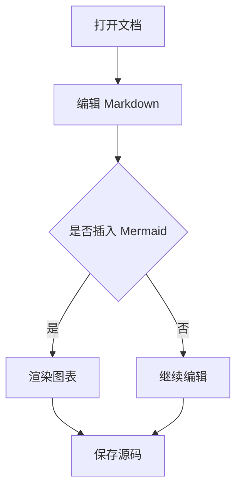
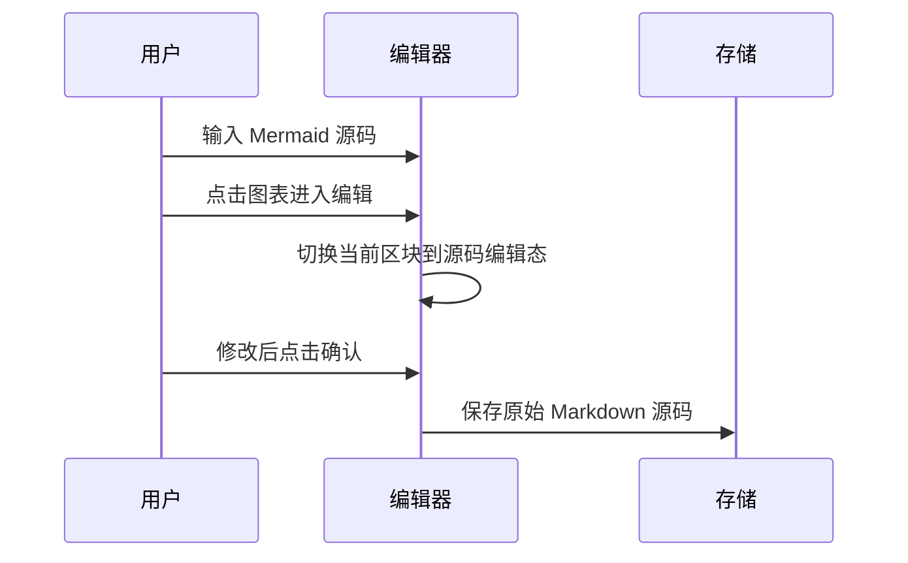

# MarkFlow 中文示例

这是一份用于测试 **MarkFlow** 的 Markdown 示例文档。


## 基础格式

- 无序列表项
- 支持 **加粗**、*斜体* 和 ~~删除线~~
- 支持 `行内代码`

1. 第一项有序列表
2. 第二项有序列表
3. 第三项有序列表

> 这是一段引用。
>
> 可用于验证块级引用样式是否正常。

---

## 任务列表

- [x] 已实现核心 Markdown 编辑器

- [x] 已增加图片支持

- [x] 已启用 Mermaid 渲染

- [ ] 后续补充更多示例文档

## 表格

| 功能 | 状态 | 说明 |
| --- | --- | --- |
| 所见即所得编辑 | 已完成 | 主要编辑体验 |
| 源码模式 | 已完成 | 直接编辑 Markdown |
| Mermaid 图表 | 已完成 | 预览渲染，保存源码 |

### 表格示例

| 模块 | 优先级 | 负责人 | 备注 |
| --- | --- | --- | --- |
| 编辑器 | 高 | Ryan | 当前主要开发区域 |
| 文件树 | 中 | MarkFlow | 支持拖拽与重命名 |
| Mermaid | 高 | Claude | 预览渲染与源码编辑 |
| 示例文档 | 低 | 文档 | 用于展示功能效果 |

## 代码块

```ts
function greet(name: string) {
  return `你好，${name}`;
}

console.log(greet('MarkFlow'));
```

## Mermaid 示例



## 第二个 Mermaid 示例



## 结束

感谢使用 MarkFlow。