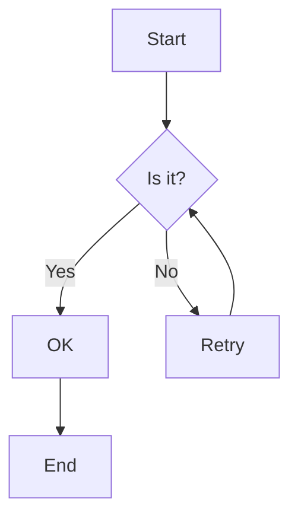
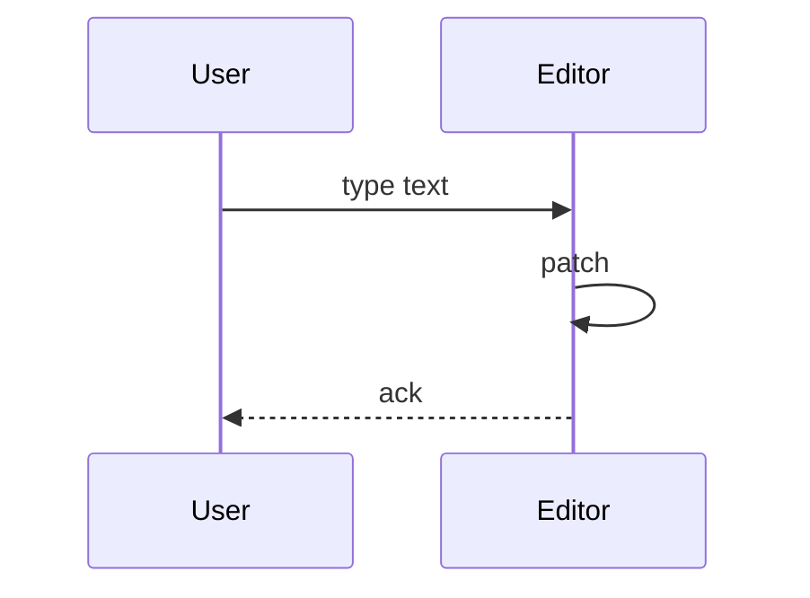
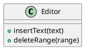
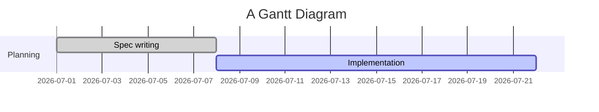

# Diagram Fixture

## Mermaid flowchart



## Mermaid sequence



## PlantUML class



## Mermaid gantt



## Fenced code that is NOT a diagram

```text
This fence has an unknown info string, not a diagram.
```
